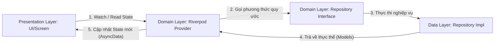

# 📱 SoloDesk Mobile — Nền tảng CRM Di động Thông minh

SoloDesk Mobile là ứng dụng quản lý quan hệ khách hàng (CRM) thế hệ mới dành cho các doanh nghiệp và cá nhân. Ứng dụng được thiết kế tối ưu với giao diện hiện đại, mượt mà, hỗ trợ quy trình bán hàng hiệu quả thông qua các tính năng đột phá như nắm bắt Lead bằng giọng nói tích hợp AI, quản lý Pipeline trực quan, phê duyệt đề xuất một chạm và hệ thống thông báo tức thời.

---

## 🏗️ Tổng quan Kiến trúc (Architecture Overview)

Dự án áp dụng **Clean Architecture** kết hợp chặt chẽ với **Riverpod (State Management)** để phân tách rõ ràng các tầng trách nhiệm (Separation of Concerns). Thiết kế này đảm bảo ứng dụng có thể kiểm thử dễ dàng (testability), bảo trì tốt, và đặc biệt là khả năng **chuyển đổi từ Mock Data sang API thực tế cực kỳ mượt mà** mà không ảnh hưởng tới lớp giao diện (UI Layer).

```
lib/
├── core/               # Tầng cấu hình và tiện ích dùng chung (Core Layer)
│   ├── constants/      # Khai báo hằng số hệ thống (App Constants, Pipeline Stages)
│   ├── router/         # Cấu hình GoRouter điều hướng thông minh (Auth Redirect)
│   ├── theme/          # Hệ thống Design System: AppColors, AppTheme (Material 3)
│   └── widgets/        # Các UI component tái sử dụng (Loading Shimmer, Error Retry)
│
├── domain/             # Tầng nghiệp vụ cốt lõi độc lập (Domain Layer)
│   ├── models/         # Định nghĩa các Data Model thực thể (User, Deal, Lead, Proposal, Notification)
│   ├── repositories/   # Định nghĩa các Interface (Abstract class) quy ước hành vi dữ liệu
│   └── providers/      # Các Riverpod Provider quản lý State và Business Logic
│
├── data/               # Tầng triển khai dữ liệu thực tế (Data Layer)
│   ├── mock_data/      # Cơ sở dữ liệu Mock tập trung cho môi trường thử nghiệm
│   └── repositories/   # Các class triển khai Interface từ Domain (giao tiếp mạng, local cache)
│
└── presentation/       # Tầng giao diện người dùng (Presentation Layer)
    ├── auth/           # Màn hình Đăng nhập & Form xác thực
    ├── home/           # Màn hình chính Layout, Bottom Navigation Bar
    ├── pipeline/       # Giao diện Quản lý Pipeline (Kanban Overview, Deal Cards)
    ├── voice_lead/     # Giao diện Nhập liệu Lead bằng Giọng nói & AI Preview
    ├── proposals/      # Giao diện Phê duyệt & Gửi nhanh Đề xuất bán hàng
    └── notifications/  # Giao diện Danh sách thông báo & Bộ đếm thông minh
```

### 🔁 Luồng Dữ liệu & Cơ chế Hoạt động (Data Flow)



1. **Presentation (UI)** chỉ tương tác với **Riverpod Providers**. UI hoàn toàn không biết dữ liệu đến từ đâu (API, SQLite local hay Mock Data).
2. **Provider** điều phối logic nghiệp vụ bằng cách gọi các phương thức định nghĩa sẵn trong **Repository Interface (Domain)**.
3. **Repository Implementation (Data)** chịu trách nhiệm lấy dữ liệu (qua HTTP Client, SQLite Database với Drift, hoặc Mock Data có độ trễ) rồi map thành các thực thể **Domain Models**.
4. **Riverpod** tự động phản hồi sự thay đổi của State và cập nhật lại UI một cách tối ưu nhất.

---

## 🎨 Quy ước Dự án (Project Conventions)

Để duy trì chất lượng mã nguồn ổn định khi làm việc nhóm lớn, dự án bắt buộc tuân thủ các quy ước sau:

### 1. Phân tách UI và Logic Nghiệp vụ (Strict Separation)
- **Không bao giờ** nhúng logic gọi HTTP/API hoặc xử lý dữ liệu phức tạp vào trong hàm `build` của Widget.
- Widget chỉ đóng vai trò hiển thị trạng thái hiện tại (`AsyncValue.when`) và phát ra các sự kiện của người dùng (gọi hàm từ Notifier).
- Tất cả các trường dữ liệu tĩnh của Model phải sử dụng `sound null safety` triệt để và được bọc trong các phương thức `copyWith`, `fromJson`, `toJson`.

### 2. Quản lý Trạng thái với Riverpod
- Sử dụng `AsyncNotifierProvider` cho các dữ liệu bất đồng bộ cần quản lý vòng đời phức tạp (như danh sách Deals, Leads, Notifications).
- Sử dụng cơ chế tự động giải phóng bộ nhớ (AutoDispose/Family) khi không còn widget nào lắng nghe để tránh rò rỉ bộ nhớ.
- Khi truy cập State, luôn sử dụng:
  - `ref.watch()` để lắng nghe thay đổi trạng thái và render lại widget.
  - `ref.read()` trong các callback sự kiện (như nhấn button) để kích hoạt action mà không làm rebuild widget không cần thiết.

### 3. Quy ước Đặt tên & Coding Style
- **File & Thư mục:** Định dạng `snake_case` (ví dụ: `pipeline_screen.dart`, `app_colors.dart`).
- **Class:** Định dạng `PascalCase` (ví dụ: `PipelineScreen`, `MockLeadRepository`).
- **Biến & Hàm:** Định dạng `camelCase` (ví dụ: `unreadCount`, `approveAndSend()`).
- Sử dụng các hằng số định nghĩa sẵn trong [app_constants.dart](file:///c:/Users/Admin/source/SEP490%20-%20SU26/src/mobile/lib/core/constants/app_constants.dart) thay vì viết cứng giá trị (Magic Numbers/Strings).

---

## 🚀 Các Tính năng Đã Triển Khai (Core Features)

Ứng dụng hiện tại đã hoàn thiện toàn bộ luồng giao diện (UI Flow), kiến trúc State và Data layer cho các tính năng:

| Tính năng | Cơ chế hoạt động | Giao diện & Hiệu ứng |
| :--- | :--- | :--- |
| **🔐 Xác thực (Auth)** | Hỗ trợ tự động chuyển hướng (`GoRouter redirect`) dựa trên trạng thái đăng nhập. Tự động kiểm tra form. | Giao diện hiện đại sử dụng gradient, hỗ trợ thông báo lỗi và trạng thái Loading ngay trên nút Đăng nhập. |
| **📊 Pipeline Overview** | Chia thành **6 giai đoạn bán hàng chuẩn**. Tự động tính tổng giá trị các giao dịch thuộc từng giai đoạn theo thời gian thực. | Stage Summary Cards cuộn ngang mượt mà, danh sách Deal sắp xếp theo thời gian mới nhất với hiệu ứng Shimmer khi tải. |
| **🎙️ Voice Lead (AI)** | Mô phỏng quá trình ghi âm tiếng Việt, tự động gọi AI Engine để phân tích cú pháp trích xuất thông tin có cấu trúc. | Ghi âm dạng sóng (Pulse Animation) bắt mắt, hiển thị văn bản real-time, card xem trước thông tin AI (Tên, SĐT, Cty) trước khi lưu. |
| **📄 Duyệt Đề xuất** | Quản lý danh sách đề xuất chia theo tab trạng thái (Chờ duyệt / Đã gửi). Hỗ trợ phê duyệt nhanh một chạm. | Thẻ đề xuất thông minh có thể mở rộng (Expandable Card) để xem nội dung chi tiết và nút "Duyệt & Gửi" trực quan. |
| **🔔 Thông báo thông minh** | Hệ thống thông báo phân loại theo mức độ ưu tiên (Cảnh báo quá hạn, Lịch hẹn, Lead mới), tự động cập nhật số lượng chưa đọc. | Hiển thị Badge động trên thanh điều hướng chính, hỗ trợ cử chỉ vuốt để đánh dấu đã đọc (Swipe to Mark Read) cực kỳ tiện lợi. |

---

## 🛠️ Hướng dẫn Cài đặt & Khởi chạy (Triển khai Dự án)

### Điều kiện Tiền đề (Prerequisites)
- Flutter SDK: `>= 3.0.0`
- Dart SDK: `>= 3.0.0`
- Thiết bị ảo (Emulator) Android/iOS hoặc thiết bị thật đã bật chế độ nhà phát triển (USB Debugging).

### 1. Tải dependencies và tài nguyên
Mở terminal tại thư mục gốc của dự án (`/src/mobile`) và chạy lệnh:
```powershell
flutter pub get
```

### 2. Tạo mã nguồn tự động (Code Generation)
Nếu bạn thay đổi cấu hình hoặc cập nhật cơ sở dữ liệu Drift SQLite (khi triển khai Phase tiếp theo), hãy chạy lệnh build runner:
```powershell
flutter pub run build_runner build --delete-conflicting-outputs
```

### 3. Khởi chạy ứng dụng trong môi trường phát triển (Debug)
Đảm bảo bạn đã kết nối thiết bị/emulator, sau đó khởi chạy:
```powershell
flutter run
```

### 4. Biên dịch và Đóng gói (Build Production)
Để tạo file APK cài đặt trực tiếp trên hệ điều hành Android để kiểm thử thực tế:
```powershell
flutter build apk --debug
```
*File đầu ra sẽ được lưu tại đường dẫn: `build/app/outputs/flutter-apk/app-debug.apk`*

---

## 🛡️ Thiết kế Chuyển đổi API thực tế (Real API Transition Design)

Khi hệ thống Backend API của SoloDesk hoàn thiện, việc chuyển đổi từ dữ liệu Mock sang API thực tế vô cùng dễ dàng và đảm bảo không gây ra lỗi hồi quy (no regression) nhờ kiến trúc tách rời của dự án. 

Ví dụ, đối với tính năng quản lý Deals:

1. **Bước 1:** Tạo class triển khai API thực tế tại tầng Data:
   ```dart
   // lib/data/repositories/api_deal_repository.dart
   class ApiDealRepository implements DealRepository {
     final HttpClient _client; // Inject HTTP client / Dio
     ApiDealRepository(this._client);

     @override
     Future<List<Deal>> getDeals() async {
       final response = await _client.get('/deals');
       return (response.data as List).map((e) => Deal.fromJson(e)).toList();
     }
     
     // Triển khai các phương thức khác từ interface...
   }
   ```

2. **Bước 2:** Thay đổi lớp triển khai được tiêm vào thông qua Riverpod Provider tại tầng Domain:
   ```dart
   // lib/domain/providers/deal_provider.dart
   
   // Trước đây (Môi trường Mock):
   // final dealRepositoryProvider = Provider<DealRepository>((ref) => MockDealRepository());
   
   // Bây giờ (Chuyển sang Real API):
   final dealRepositoryProvider = Provider<DealRepository>((ref) {
     final client = ref.read(httpClientProvider);
     return ApiDealRepository(client);
   });
   ```

**Toàn bộ mã nguồn thuộc lớp UI (`PipelineScreen`, `DealListTile`) và State Management (`DealNotifier`) sẽ giữ nguyên 100% không cần thay đổi bất kỳ dòng code nào!**
